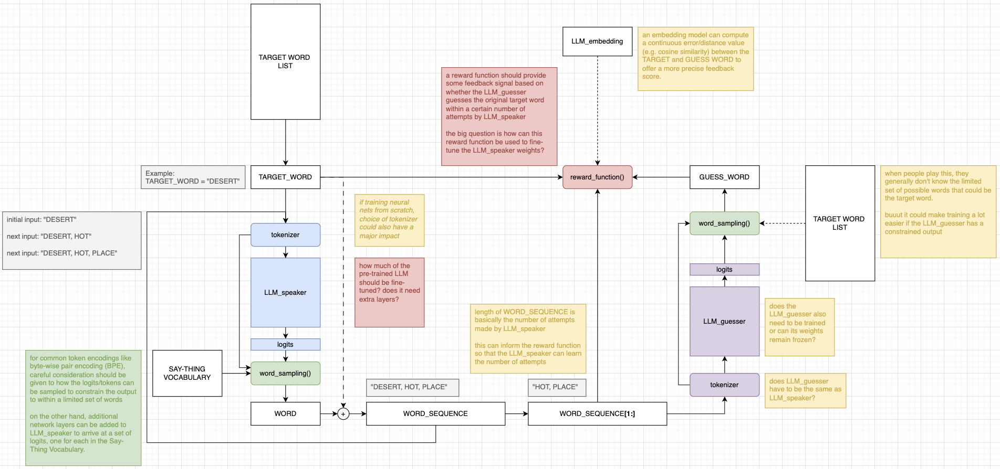

# Development Log

## 2026-05-29 "Grasping at words a latent space..."

One weekend at the Recurse Center, I was playing this game called Person-Do-Thing, where a player (*speaker*) sees a **target word** on the card and can only say simple words from a small list (*say thing vocabulary*)

As I was trying to guess the word that was on a player's card, I instinctively sensed my mind was grasping at a word in this latent space, trying to follow the simpler spoken words pointing in a certain direction.

So naturally I thought, "oh hey how can LLMs play this game?"

And I think given my previous work with RL and LLM fine-tuning, I arrived at this kind of simulation game-based training:

- LLM_speaker spits out a sequence of words among the limited list of *say thing vocabulary* after receiving the target word as initial input.
- LLM guesser tries to guess the target word given the sequence of words
- A reward function provides a signal back to the LLM speaker to update some or all of that LLM's weights

The diagram above highlights a lot of open questions and ideas that I'm hoping to explore, but the big thing is...I've never implemented RL-HF for LLMs before.

And this is more RL-LLM Feedback than Human Feedback! 

I'm excited.

As a "first pass" I've coded a training loop in [/src/train.py](../src/train.py) using a GPT-2 model as a kind of placeholder...but there's a lot of stuff missing for things I need to figure out for the script to actually run.

PS

After some quick chats with other Recursers, I'm now aware that [past attempts](https://www.scd31.com/posts/person-do-thing-llm) have been made to train LLMs to play this game. I'm planning to look into their ideas in a bit...but I'd like to first see the "RL training way" to the end (likely a complete but dead-end) before considering approaches.