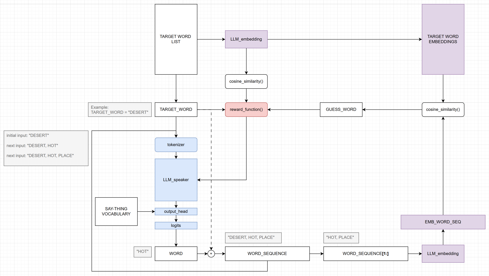

# Development Log

## 2026-06-07 Keep it simple

I thought over more about the embedding model and the reward function and figure out a "simpler" approach:



Instead of relying on another LLM to guess a word via next-token prediction, an LLM embedding model can be used to guess the target word by computing cosine similarity between the  by the LLM speaker's word sequence output and the embeddings of all the possible target words. The guess word would always be one of the possible target words.

The reward function can then compute the cosine similarity between the guessed word and target word*

```
reward = util.cos_sim(target_word_emb, guess_word_emb)
```

For simplicity, the LLM speaker is a pre-trained GPT-2 with the final output head replace with a linear layer that outputs 33 logit scores, one for each of the possible words in the Say Thing Vocabulary.

The loss function that's used to update the weights is:

```
loss = -reward * log_prob_last_word
```

where `log_prob_last_word` is the log-likelihood of the last word predicted by LLM speaker. In a way this represents the confidence in the word being helpful or not to leading to a guess. 
- When the guess word is closer to the target word in embedding space, the reward increases and loss decreases
- If the LLM speaker computed a very low probability of the last word it output, log_prob_last_word will be a very large negative number. This will increase the scale of the loss significantly, in effect telling the LLM speaker "you should be much more confident in this prediction next time.
- This loss function still doesn't quite feel right to me for a few reasons, but at the very least it ties the reward to the LLM speaker's predictions, so that `loss.backward()` will actually work.

To further move things along, after a guessed word is found to not match the target word, it is popped off the guesser's list and not considered for future guesses in the episode.

### Initial results

Basic setup/training parameters
- `LLM_emb = SentenceTransformer("all-MiniLM-L6-v2")` 
- `LLM_speaker = GPT2` with an output dim 33 linear layer. Default settings load a pretrained GPT-2 124M (small) weights then freezes all but the last transformer block and the output layer for fine-tuning.
- target word list = `website_word_list.txt` based on the possible words from the persondothing.com website
- 1000 training episodes
- 10 rounds: `LLM_speaker` can output up to 10 words from Say Thing Vocabulary.
- 3 strikes for repeated words: If `LLM_speaker` says the same word three times, the episode ends early (because why would anyone say the same word more than two times if it's not helping the guesser?)

When the learning rate is `3e-4` this last constraint gets triggered all the time:

```
episode 699: whisper # target word for the training episode
thing, prob=0.999, log_prob=-0.0005460678366944194 # for the last word predicted by LLM_speaker
shadow, similarity score=0.30 # guesser's word
loss=0.00016157238860614598

episode 699: whisper
thing thing, prob=1.000, log_prob=-2.9802276912960224e-06
magnet, similarity score=0.20
loss=6.048866794117203e-07

episode 699: whisper
thing thing thing, prob=1.000, log_prob=-4.768370445162873e-07
octopus, similarity score=0.20
loss=9.455845173533817e-08
```

Tracking the probability for the `LLM_speaker`'s prediction helped detect that the predictions were "hardened" such that the speaker is super confident that the only way is to keep repeating the same word.

I tried a few other things like forcing random word exploration, but eventually found that decreasing the learning rate to `1e-6` had some promising effects in at least encourage different sequences of words.

```
episode 699: whisper
use, prob=0.642, log_prob=-0.444
library, similarity score=0.18
loss=0.078

episode 699: whisper
use make, prob=0.353, log_prob=-1.041
kitchen, similarity score=0.29
loss=0.301

episode 699: whisper
use make use, prob=0.625, log_prob=-0.470
harvest, similarity score=0.20
loss=0.092

episode 699: whisper
use make use fast, prob=0.022, log_prob=-3.826
bakery, similarity score=0.15
loss=0.579

episode 699: whisper
use make use fast use, prob=0.275, log_prob=-1.291
whisper, similarity score=1.00
loss=1.291
```

So now at least by some luck, the guesser finds the target word. Here's another lucky (hilarious) example.

```
episode 399: elephant
real use thing use use fast thing thing use, prob=0.476, log_prob=-0.742
elephant, similarity score=1.00
loss=0.742
```

Just imagine you had a board in front of you with a list of the target words and then some person just said to you "real use thing use use fast thing thing use"...would you be able to know they meant to say "elephant"?

I still have yet to implement temperature scaling to further encourage word exploration by the LLM_speaker. But perhaps the more troubling thing is that the loss seems to be very high when the guesser guesses the correct word. So the loss function seems something worth revisiting first (before other models, other reward functions, other ways of guessing)

It's also crossed my mind as I coded this approach that an even "simpler" approach would be something like conventional dynamic programming, where every possible sequence of words in the Say Thing Vocabualary is converted into an embedding vector and compared to all possible target words. this would be useful to try out because it can sorta check if there are possible ways to guess a target word based on Say Thing Vocabulary words in "one shot" (the way the game is normally played is via intermediate concepts that build on each other after someone asks "Is it something to do with X" and the speaker can just answer Yes or No)

## 2026-05-29 "Grasping at words a latent space..."

One weekend at the Recurse Center, I was playing this game called Person-Do-Thing, where a player (*speaker*) sees a **target word** on the card and can only say simple words from a small list (*say thing vocabulary*)

As I was trying to guess the word that was on a player's card, I instinctively sensed my mind was grasping at a word in this latent space, trying to follow the simpler spoken words pointing in a certain direction.

So naturally I thought, "oh hey how can LLMs play this game?"

And I think given my previous work with RL and LLM fine-tuning, I arrived at this kind of simulation game-based training:


- LLM_speaker spits out a sequence of words among the limited list of *say thing vocabulary* after receiving the target word as initial input.
- LLM guesser tries to guess the target word given the sequence of words
- A reward function provides a signal back to the LLM speaker to update some or all of that LLM's weights

The diagram above highlights a lot of open questions and ideas that I'm hoping to explore, but the big thing is...I've never implemented RL-HF for LLMs before.

And this is more RL-LLM Feedback than Human Feedback! 

I'm excited. Though I'm sure the base LLM architecture matters a lot, I'm much more interested in at the moment on how the reward function can be formulated and be used to update the LLM weights/parameters and how to effectively limit/constrain the LLM's outputs to specific tokens/words (token sampling vs transfer learning layers).

As a "first pass" I've coded a training loop in [/src/train.py](../src/train.py) using a GPT-2 model as a kind of placeholder...but there's a lot of stuff missing for things I need to figure out for the script to actually run.

PS

After some quick chats with other Recursers, I'm now aware that [past attempts](https://www.scd31.com/posts/person-do-thing-llm) have been made to train LLMs to play this game. I'm planning to look into their ideas in a bit...but I'd like to first see the "RL training way" to the end (likely a complete but dead-end) before considering approaches.